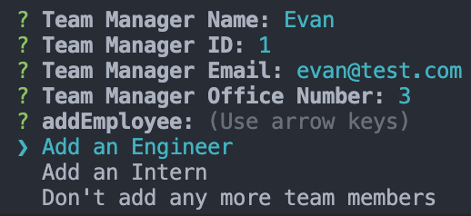
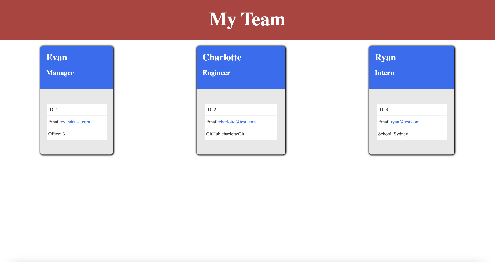

# Team Profile Generator

## License

https://opensource.org/licenses/MIT

## Table of Contents
* [Description](#description) 
* [Installation Instructions](#installation)
* [Usage Instructions](#usage)
* [Contribution Guide](#contribute)
* [Tests](#tests)
* [Questions](#questions)

## Description
This project allows users to create a webpage form the command line that displays team members, with different roles in the company. The application runs in the command line and initially prompts a user to allocate a team manager. 

Once complete, the user is prompted to whether they would like to add another team member and can select either an intern or an engineer. This then prompts the user to provide information about the user, before runnig the same process until a user selects not adding a new team member. Once complete, the program creates objecs for each team member and generates an HTML team member card for them. This is then rendered to the page and styled using a set of css in the same directory.

There is currently no way to add more team members to the same organisation in the app without overwriting the current ones. This is a consideration for future development.

A video demonstration is available at: 
https://watch.screencastify.com/v/9g0DsFupwyJPviNwVNoV

## Installation
To Install and run this application yourself, follow the below step(s).

    npm i

## Usage
Install the dependacnies with the above instructions and run it using npm start

## Contribute
This project is finished and does not need contributions

## Questions
For any questions about the code please see my github for source code, email me at the address provided, or find my social media links on my portfolio website. 
* https://github.com/EvanCWoods
* evan.woods.dev@gamil.com
* https://evancwoods.github.io/Evan-Woods-Portfolio/
